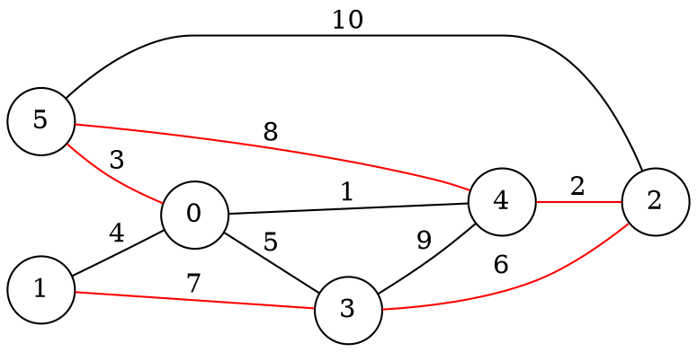
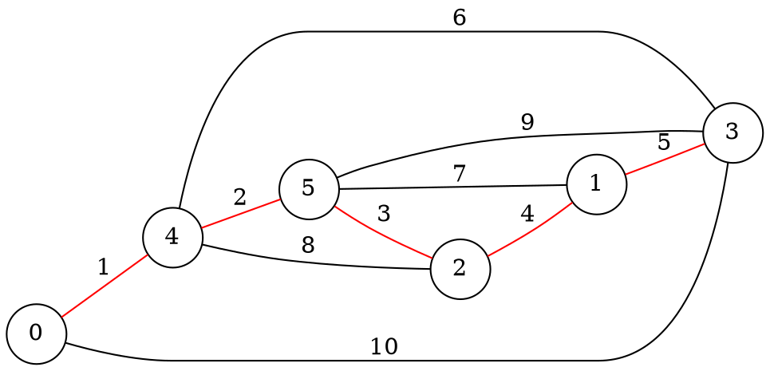

# Test Cases

## Case 1

### Adjacency Matrix

    node0:0|4|0|5|1|3
    node1:4|0|0|7|9|0
    node2:0|0|0|6|2|10
    node3:5|7|6|0|4|0
    node4:1|0|2|1|0|8
    node5:3|0|10|0|8|0

### Graph

    Begin:

    Node 0
        Status: sleeping
        Links:
            0--1: basic
            0--3: basic
            0--4: basic
            0--5: basic
    Node 1
        Status: sleeping
        Links:
            1--0: basic
            1--3: basic
    Node 2
        Status: sleeping
        Links:
            2--3: basic
            2--4: basic
            2--5: basic
    Node 3
        Status: sleeping
        Links:
            3--0: basic
            3--1: basic
            3--2: basic
            3--4: basic
    Node 4
        Status: sleeping
        Links:
            4--0: basic
            4--2: basic
            4--3: basic
            4--5: basic
    Node 5
        Status: sleeping
        Links:
            5--0: basic
            5--2: basic
            5--4: basic        

initial = 0

Coordinator.send(nodes[initial],"WakeUP")

    Node 0
        Status: found
        Links:
            0--1: basic
            0--3: basic
            0--4: branch
            0--5: basic
        fragment-level: 0

    Request Connect: 0-->4

    Node 4
        Status: sleeping
        Links:
            4--0: branch
            4--2: basic
            4--3: basic
            4--5: basic
        fragment-level: 1
        fragment-ID: 1

    Node 0
        fragment-level: 1
        fragment-ID: 1

    
## Case 2

### Adjacency Matrix

    node0: 0|0|0|10|1|0
    node1: 0|0|4|5|0|7
    node2: 0|4|0|0|8|3
    node3: 10|5|0|0|6|9
    node4: 1|0|8|6|0|5
    node5: 0|7|3|9|2|0

### Graph

